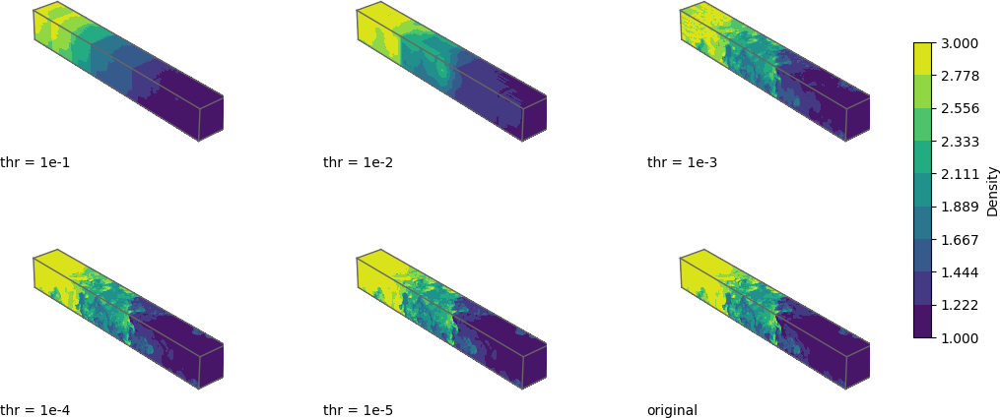

# Tensor Train Decomposition for Compression – A Practical Example in Xerus
This repository provides an example of tensor train (TT) decomposition using the [Xerus](https://libxerus.org/) library, demonstrating its effectiveness in compressing high-order tensors.

## Objective
Higher-order tensors present significant computational challenges due to the curse of dimensionality, leading to high storage requirements and expensive computations. Developing efficient compression techniques is crucial for handling such large-scale data.

In their work, Ballard, Kolda, and Lindstrom use the [Miranda Turbulent Flow Dataset](https://gitlab.com/tensors/tensor_data_miranda_sim) to illustrate the successful application of Tucker decomposition for tensor compression. This repository aims to showcase how Tensor-Train decomposition can achieve even better performance.

Additionally, we highlight the simplicity and usability of the [Xerus](https://libxerus.org/) library, which offers efficient tensor computation tools, with strong support for Tensor-Train format and general tensor networks.

## The dataset
The [Miranda Turbulent Flow Dataset](https://gitlab.com/tensors/tensor_data_miranda_sim) represents a Rayleigh-Taylor instability simulation, where two fluids of different densities accelerate against each other, leading to turbulent mixing. The dataset captures a late-stage time step of this instability, computed using the Miranda software from Lawrence Livermore National Laboratory (LLNL) and is published by the [Scientific data reduction benchmark (SDRBench)](https://sdrbench.github.io). We utilize the pre-processed subtensor from Ballard et al. with dimensions `2048 x 256 x 256`.

## Files
* `density.mat` - Input MATLAB file, uploaded with Git LFS.
* `Miranda.cpp` - C++ implementation for computing the Tensor-Train compressions. Requires [Xerus](https://libxerus.org/building_xerus/), [Matio](https://github.com/tbeu/matio/tree/master) (available on Ubuntu via `sudo apt install libmatio-dev`) and at least 7+ GB of RAM.
* `xerusTensors/` - Contains the uncompressed Xerus tensor and Tensor-Train tensor.
* `compressionResults/` - Stores the MAT files of the compressed tensors, generated for different thresholds `1e-x`.
* `visualization/` - Includes the Python script for 3D visualization and the resulting PNG image.

## Result
We first computed the full-rank Tensor-Train decomposition and then used the Xerus round() function to compress the tensor to the desired threshold. While this function will find a sufficient approximation, it does not necessarily yield the best estimate. In accordance with Ballard et al., we used the squared error in Frobenius norm ($||X - T||_F^2 / ||X||_F^2$).

Our results show that even for a relative error of 1e-8, the Tensor-Train approximation takes less than 4% of the original storage size. The [Tucker decomposition](https://gitlab.com/tensors/tensor_data_miranda_sim/-/tree/main?ref_type=heads#computing-tucker-and-visualization-of-compressed-results) was only evaluated up to a threshold of 1e-4 and for these values the comparison reveals 10 to 100 times better compression ratios for the TT decomposition.

| Threshold | Rel. Error | TT-Ranks      | Entries   | Compression Ratio | % of Original Size |
|-----------|-----------|------------|-----------|-------------------|--------------------|
| 1e-1      | 1.8e-2    | [1, 1]     | 2,560     | 52,416.00         | 0.0019             |
| 1e-2      | 8.9e-3    | [3, 3]     | 9,216     | 14,559.11         | 0.0069             |
| 1e-3      | 9.5e-4    | [72, 19]   | 344,576   | 389.57            | 0.2568             |
| 1e-4      | 9.7e-5    | [245, 43]  | 1,152,960 | 116.36            | 0.8590             |
| 1e-5      | 9.8e-6    | [458, 72]  | 2,089,984 | 64.24             | 1.5569             |
| 1e-6      | 9.7e-7    | [682, 103] | 3,083,264 | 43.54             | 2.2970             |
| 1e-7      | 9.9e-8    | [904, 133] | 4,090,880 | 32.80             | 3.0499             |
| 1e-8      | 1.0e-8    | [1120, 161]| 5,127,936 | 26.18             | 3.8200             |

In our visualization, we show the results of the first five compressions together with the original tensor.

## References
* G. Ballard, T. G. Kolda, and P. Lindstrom, Miranda Turbulent Flow Dataset, https://gitlab.com/tensors/tensor_data_miranda_sim, 2022.
* K. Zhao, S. Di, X. Liang, S. Li, D. Tao, J. Bessac, Z. Chen, and F. Cappello, SDRBench: Scientific Data Reduction Benchmark for Lossy Compressors, 2020 IEEE International Conference on Big Data (Bigdata20), 2020, https://doi.org/10.1109/bigdata50022.2020.9378449 
* W. H. Cabot, and A. W. Cook, Reynolds number effects on Rayleigh-Taylor instability with possible implications for type Ia supernovae, Nature Physics, Vol. 2, No. 8, pp. 562-568, July 2006, https://doi.org/10.1038/nphys361
* B. Huber, and S. Wolf, Xerus - A General Purpose Tensor Library, 2014-2017, https://libxerus.org/